# RCCL AllReduce Software Flow Analysis

## Overview
This document provides a detailed sequence diagram and analysis of the RCCL allReduce collective implementation based on code analysis of the RCCL codebase.

## High-Level Flow Summary

1. **API Entry** - User calls `ncclAllReduce()`
2. **Validation & Setup** - Create operation info and validate parameters
3. **Task Enqueuing** - Add task to planner queue
4. **Group Management** - Handle group semantics (batch operations)
5. **Algorithm Selection** - Choose algorithm (Ring/Tree) and protocol (Simple/LL/LL128)
6. **Plan Building** - Build kernel execution plan with work distribution
7. **Kernel Launch** - Launch GPU kernel via HIP
8. **GPU Execution** - Execute collective operation on GPU
9. **Proxy Operations** - Handle network communication (if multi-node)
10. **Completion** - Synchronize and return

---

## Detailed Sequence Diagram

```mermaid
sequenceDiagram
    participant User as User Application
    participant API as ncclAllReduce_impl()<br/>(collectives.cc)
    participant Enqueue as ncclEnqueueCheck()<br/>(enqueue.cc)
    participant TaskMgr as taskAppend()<br/>(enqueue.cc)
    participant Group as ncclGroupEnd()<br/>(group.cc)
    participant Planner as ncclLaunchPrepare()<br/>(enqueue.cc)
    participant Tuning as Algorithm/Protocol<br/>Selection (tuning.cc)
    participant Builder as buildPlan()<br/>(enqueue.cc)
    participant Launch as ncclLaunchKernel()<br/>(enqueue.cc)
    participant GPU as GPU Kernel<br/>(ncclDevKernel_Generic)
    participant Primitives as ncclPrimitives<br/>(primitives.h)
    participant Proxy as ncclProxy Thread<br/>(proxy.cc)
    
    Note over User,Proxy: Phase 1: API Call & Validation
    
    User->>API: ncclAllReduce(sendbuf, recvbuf,<br/>count, datatype, op, comm, stream)
    activate API
    
    Note right of API: Create ncclInfo struct with:<br/>- func = ncclFuncAllReduce<br/>- buffers, count, datatype<br/>- operation, communicator
    
    API->>API: Check MSCCL availability<br/>(optimization path)
    
    API->>Enqueue: ncclEnqueueCheck(&info)
    activate Enqueue
    
    Note over Enqueue: Phase 2: Enqueue & Group Management
    
    Enqueue->>Enqueue: ncclGroupStartInternal()<br/>(increment group depth)
    Enqueue->>Enqueue: CommCheck(comm)<br/>Validate communicator
    Enqueue->>Enqueue: ncclCommEnsureReady(comm)<br/>Wait for comm initialization
    Enqueue->>Enqueue: ArgsCheck(info)<br/>Validate buffers & parameters
    
    Enqueue->>TaskMgr: taskAppend(comm, info)
    activate TaskMgr
    
    Note right of TaskMgr: Check if single rank:<br/>Use cudaMemcpyAsync shortcut
    
    alt Single Rank (nRanks == 1)
        TaskMgr->>TaskMgr: ncclLaunchOneRank()<br/>(direct memory copy)
        TaskMgr-->>Enqueue: return
    else Multi Rank
        Note right of TaskMgr: Create collective task
        TaskMgr->>TaskMgr: ncclGroupCommJoin()<br/>(join thread-local group)
        TaskMgr->>TaskMgr: Allocate ncclTaskColl<br/>from memory pool
        
        Note right of TaskMgr: Initialize task:<br/>- func, buffers, count<br/>- datatype, op, root<br/>- chunkSteps, sliceSteps
        
        TaskMgr->>TaskMgr: ncclIntruQueueEnqueue()<br/>(add to planner queue)
        TaskMgr->>TaskMgr: planner->nTasksColl++
        TaskMgr-->>Enqueue: return
    end
    deactivate TaskMgr
    
    Enqueue->>Enqueue: ncclGroupEndInternal()
    Enqueue->>Group: (if groupDepth == 1)
    deactivate Enqueue
    
    Note over Group: Phase 3: Group End & Launch Preparation
    
    activate Group
    Group->>Group: Execute preconnect jobs<br/>(setup transport connections)
    
    loop For each comm in group
        Group->>Planner: ncclLaunchPrepare(comm)
        activate Planner
        
        Note right of Planner: Phase 4: Build Execution Plan
        
        Planner->>Planner: ncclMemoryPoolUnclaim()<br/>(prepare memory pools)
        Planner->>Planner: ncclTaskBuildCollective()
        
        Note right of Planner: For each collective task:
        
        Planner->>Tuning: Algorithm & Protocol Selection
        activate Tuning
        
        Note right of Tuning: Select based on:<br/>- Message size<br/>- Number of ranks<br/>- Topology (intra/inter node)<br/>- Protocol thresholds
        
        Tuning->>Tuning: Choose Algorithm:<br/>- RING (bandwidth optimal)<br/>- TREE (latency optimal)<br/>- COLLNET (switch-based)
        
        Tuning->>Tuning: Choose Protocol:<br/>- SIMPLE (large messages)<br/>- LL128 (medium messages)<br/>- LL (small messages)
        
        Tuning-->>Planner: algorithm, protocol, nChannels
        deactivate Tuning
        
        Note right of Planner: Create task structure
        Planner->>Planner: Calculate work distribution:<br/>- Channel assignment<br/>- Chunk sizes<br/>- Slice steps
        
        Planner->>Builder: buildPlan(comm, plan)
        activate Builder
        
        Note right of Builder: Phase 5: Build Kernel Plan
        
        Builder->>Builder: For each work node:<br/>create device work structures
        
        Builder->>Builder: setupCollKernel():<br/>- Allocate devWork<br/>- Set channel ranges<br/>- Calculate chunk counts
        
        Builder->>Builder: Calculate proxy operations<br/>(for network communication)
        
        loop For each channel
            Builder->>Builder: addWorkBatchToPlan()<br/>(create work batches)
            
            alt Network communication needed
                Builder->>Builder: addProxyOpIfNeeded()<br/>(enqueue proxy operation)
            end
        end
        
        Builder->>Builder: Select kernel function:<br/>ncclDevKernel_Generic_<1|2|4>
        
        Builder-->>Planner: Kernel plan ready
        deactivate Builder
        
        Planner-->>Group: Plan built
        deactivate Planner
    end
    
    Note over Group: Phase 6: Launch Kernels
    
    loop For each comm in group
        Group->>Launch: ncclLaunchKernel(comm, plan)
        activate Launch
        
        Note right of Launch: Prepare launch parameters:<br/>- grid = {nChannels, 1, 1}<br/>- block = {threadPerBlock, 1, 1}<br/>- smem = dynamic shared memory
        
        Launch->>Launch: Configure launch attributes:<br/>- Cluster size (CGA)<br/>- Sync domain<br/>- Completion events
        
        Launch->>GPU: hipExtLaunchKernel(kernelFn,<br/>grid, block, args, smem, stream)
        activate GPU
        
        Note over GPU: Phase 7: GPU Kernel Execution
        
        GPU->>GPU: ncclKernelMain()<br/>(device/common.cu)
        
        Note right of GPU: Setup phase:<br/>- Load kernel args<br/>- Initialize channels<br/>- Setup primitives
        
        GPU->>GPU: loadArgs():<br/>load work batches and tasks
        
        loop For each work batch
            GPU->>GPU: Determine work type:<br/>- Coll (collective)<br/>- P2P (point-to-point)
            
            alt Collective Work (AllReduce)
                GPU->>Primitives: Initialize primitives<br/>for algorithm/protocol
                activate Primitives
                
                Note right of Primitives: Phase 8: Execute Collective
                
                alt Ring Algorithm
                    Note right of Primitives: Reduce-Scatter Phase
                    loop N-1 steps
                        Primitives->>Primitives: send(chunk_i) to next rank
                        Primitives->>Primitives: recv(chunk_j) from prev rank
                        Primitives->>Primitives: reduce(local, received)
                    end
                    
                    Note right of Primitives: AllGather Phase
                    loop N-1 steps
                        Primitives->>Primitives: send(reduced_chunk) to next
                        Primitives->>Primitives: recv(reduced_chunk) from prev
                    end
                    
                else Tree Algorithm
                    Primitives->>Primitives: Reduce up tree (log N steps)
                    Primitives->>Primitives: Broadcast down tree (log N steps)
                end
                
                Note right of Primitives: Protocol-specific operations:<br/>SIMPLE: direct memory ops<br/>LL128: 128-bit with flags<br/>LL: low-latency protocol
                
                Primitives->>Primitives: Memory operations:<br/>- Load from sendbuf<br/>- Reduce (sum/min/max/etc)<br/>- Store to recvbuf
                
                alt Multi-node (network involved)
                    Note right of Primitives: Signal proxy for network ops
                    Primitives->>Proxy: Post work to proxy queue
                    activate Proxy
                    
                    Note right of Proxy: Phase 9: Proxy Operations
                    
                    Proxy->>Proxy: ncclProxyProgress():<br/>process network ops
                    
                    loop While operations pending
                        Proxy->>Proxy: Check operation queue
                        
                        alt Send Operation
                            Proxy->>Proxy: Post send via IB/NET
                        else Receive Operation  
                            Proxy->>Proxy: Post recv via IB/NET
                        end
                        
                        Proxy->>Proxy: Poll for completions
                        Proxy->>Proxy: Update completion flags
                    end
                    
                    Proxy-->>Primitives: Network ops complete
                    deactivate Proxy
                end
                
                Primitives->>Primitives: Synchronize threads<br/>(__syncthreads)
                Primitives-->>GPU: Work batch complete
                deactivate Primitives
            end
        end
        
        GPU->>GPU: Finalization:<br/>- Update completion counters<br/>- Signal done event
        
        GPU-->>Launch: Kernel enqueued
        deactivate GPU
        
        Launch-->>Group: Launch complete
        deactivate Launch
    end
    
    Note over Group: Phase 10: Completion
    
    Group->>Group: Check for async errors
    Group-->>API: Group operations complete
    deactivate Group
    
    API-->>User: ncclSuccess<br/>(or error code)
    deactivate API
    
    Note over User: Kernel executes asynchronously<br/>on GPU stream.<br/>User can sync with stream or event.
```



---

## Key Components Breakdown

### 1. **API Layer** (`src/collectives.cc`)
- **ncclAllReduce_impl()**: Entry point that creates `ncclInfo` structure
- Checks for MSCCL (Microsoft Collective Communication Library) optimizations
- Delegates to `ncclEnqueueCheck()`

### 2. **Enqueue Layer** (`src/enqueue.cc`)
- **ncclEnqueueCheck()**: Validates communicator and arguments
- **taskAppend()**: Creates task and adds to planner queue
- Handles group semantics (batching multiple operations)

### 3. **Group Management** (`src/group.cc`)
- **ncclGroupStart/End**: Batch multiple operations together
- **doLaunches()**: Triggers plan building and kernel launches
- Manages preconnection setup for transport

### 4. **Algorithm & Protocol Selection** (`src/graph/tuning.cc`)
- Selects algorithm based on:
  - **Ring**: Bandwidth-optimal, 2(N-1) steps
  - **Tree**: Latency-optimal, 2*log(N) steps
  - **CollNet**: Switch-accelerated collectives
- Selects protocol based on message size:
  - **Simple**: Large messages (>512 KB), standard memory operations
  - **LL128**: Medium messages (8-512 KB), 128-bit with inline flags
  - **LL**: Small messages (<8 KB), low-latency with head/tail

### 5. **Plan Building** (`src/enqueue.cc`)
- **ncclLaunchPrepare()**: Builds execution plan
- **buildPlan()**: Creates device work structures
- **setupCollKernel()**: Configures work distribution across channels
- Calculates chunk sizes and channel assignments

### 6. **Kernel Launch** (`src/enqueue.cc`)
- **ncclLaunchKernel()**: Launches GPU kernel via HIP
- Uses `hipExtLaunchKernel()` with:
  - Grid: one block per channel
  - Block: configurable threads (typically 512-1024)
  - Shared memory: dynamic allocation for protocol

### 7. **GPU Kernel** (`src/device/common.cu`)
- **ncclDevKernel_Generic**: Generic kernel entry point
- **ncclKernelMain()**: Main kernel logic
- Loads work batches and executes collective operations
- Specialized for different unroll factors (1, 2, 4)

### 8. **Primitives Layer** (`src/device/primitives.h`)
- **ncclPrimitives**: Template class for send/recv/reduce operations
- Implements algorithm-specific logic:
  - Ring: sequential send/recv around ring
  - Tree: hierarchical reduce/broadcast
- Protocol-specific implementations in:
  - `prims_simple.h`: Standard memory operations
  - `prims_ll128.h`: 128-bit operations with flags
  - `prims_ll.h`: Low-latency operations

### 9. **Proxy Thread** (`src/proxy.cc`)
- **ncclProxy**: Handles network operations asynchronously
- Runs in separate CPU thread per communicator
- Manages:
  - Network send/recv via IB or sockets
  - Memory registration for RDMA
  - Completion polling

### 10. **Transport Layer** (`src/transport/`)
- **p2p.cc**: Peer-to-peer (GPU-to-GPU) within node
- **net_ib.cc**: InfiniBand network transport
- **net_socket.cc**: TCP/IP socket transport
- **shm.cc**: Shared memory for intra-node

---

## Ring AllReduce Algorithm Detail

The Ring algorithm is the most common for allReduce:

### Phase 1: Reduce-Scatter (N-1 steps)
```
Step 0:  Rank 0: [A] → [A]     Rank 1: [B] → [B]     Rank 2: [C] → [C]     Rank 3: [D] → [D]
Step 1:  Rank 0: [A] → [A+D]   Rank 1: [B] → [B+A]   Rank 2: [C] → [C+B]   Rank 3: [D] → [D+C]
Step 2:  Rank 0: [A+D] → [A+C+D] Rank 1: [B+A] → [A+B+D] Rank 2: [C+B] → [B+C+A] Rank 3: [D+C] → [C+D+B]
...
After N-1 steps, each rank has 1/N of the final result
```

### Phase 2: AllGather (N-1 steps)
```
Each rank now distributes its reduced chunk to all other ranks
After N-1 steps, all ranks have the complete reduced result
```

---

## Protocol Selection Heuristics

### Simple Protocol
- **Use Case**: Large messages (> 512 KB)
- **Mechanism**: Direct GPU memory operations
- **Overhead**: Minimal
- **Throughput**: Maximum bandwidth

### LL128 Protocol  
- **Use Case**: Medium messages (8 KB - 512 KB)
- **Mechanism**: 128-bit operations with inline flags for synchronization
- **Overhead**: Moderate (~25% overhead)
- **Throughput**: Good balance

### LL (Low Latency) Protocol
- **Use Case**: Small messages (< 8 KB)
- **Mechanism**: Single instruction with head/tail flags
- **Overhead**: Higher (~4x data size due to flags)
- **Latency**: Minimal pipeline bubbles

---

## Performance Considerations

### Channel Parallelism
- Multiple channels execute in parallel across different GPU blocks
- Channels map to different PCIe/NVLink paths
- Load balancing across channels for optimal bandwidth

### Memory Coalescing
- GPU threads access memory in coalesced patterns
- Chunk sizes aligned to cache line boundaries
- Minimizes memory bandwidth waste

### Network Optimization
- Proxy thread offloads network operations from GPU
- RDMA for zero-copy transfers (when available)
- Pipeline network and GPU operations

### Topology Awareness
- Algorithm selection considers:
  - Intra-node: prefers shared memory/NVLink
  - Inter-node: prefers ring or tree based on network topology
  - Switch-based: can use CollNet acceleration

---

## Source File Reference

| Component | Source File | Key Functions |
|-----------|-------------|---------------|
| API Entry | `src/collectives.cc` | `ncclAllReduce_impl()` |
| Enqueue | `src/enqueue.cc` | `ncclEnqueueCheck()`, `taskAppend()` |
| Group Mgmt | `src/group.cc` | `ncclGroupEnd()`, `doLaunches()` |
| Tuning | `src/graph/tuning.cc` | Algorithm/protocol selection |
| Plan Build | `src/enqueue.cc` | `ncclLaunchPrepare()`, `buildPlan()` |
| Kernel Launch | `src/enqueue.cc` | `ncclLaunchKernel()` |
| GPU Kernel | `src/device/common.cu` | `ncclDevKernel_Generic`, `ncclKernelMain()` |
| Primitives | `src/device/primitives.h` | `ncclPrimitives<>` template |
| Proxy | `src/proxy.cc` | `ncclProxyProgress()` |
| Transport | `src/transport/` | Various transport implementations |

---

## Optimization Opportunities

Based on this flow analysis, key optimization areas include:

1. **Enqueue Path**: Reduce validation overhead for repeated calls
2. **Algorithm Selection**: Cache decisions for similar message sizes
3. **Memory Coalescing**: Improve GPU memory access patterns
4. **Channel Load Balancing**: Better work distribution
5. **Proxy Efficiency**: Reduce CPU overhead in network path
6. **Pipeline**: Overlap computation and communication

---

## Conclusion

The RCCL allReduce implementation follows a sophisticated multi-layer architecture:
- Host-side: API → Enqueue → Plan → Launch
- Device-side: Kernel → Primitives → Algorithm
- Async: Proxy thread for network operations

This design provides flexibility for different hardware topologies, message sizes, and performance requirements while maintaining a clean separation of concerns.


